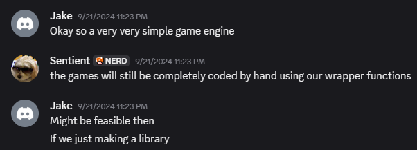

# Squiggly

***

> An esoteric scripting language for game dev

The idea for Squiggly was born from my friend saying he wanted to make a mini game console with Arduino, similar to a Game Boy.

 

The idea was to originally make an Arduino library that would act as a sort of game engine. Being excited to have a fun project to do during my winter break, I became overly optimistic about what the project could become...



Of course, being as excited as I was, I started working on it early and made it a solo project for myself. What I estimated to be a fun winter break project became a 9 month passion project that turned into my very first programming language: **Squiggly**!

> As a little side note: No, I did not do much research as to how to build an interpreted language. Would that have been smart? Definitely. I did as a professor at my school for some advice, but by the time I did I already had made a considerable amount of progress I did not want to loose yet with a redesign. 

> Despite my stubbornness, I enjoyed the challenge of coming up with my own design for an interpreted language. Although the final product might not be the best, I'm still proud of what I came up with

## What did I actually learn?

Quite a lot actually!

This was the first large-ish scale project I made with C++! I taught myself how to use CMake to generate Makefiles for my project, how to use C++ shared pointers, and how to write portable code. 

I also improved upon a lot of my pre-existing skills like:
 - Git + GitHub
    - I used version control *a lot* in this project. It's saved me from more failed experiments than I can count.
- Large project planning
    - I love sketching out the architecture of a project before starting to write code. Squiggly was no exception. I sat down with a pen and paper and put a lot of thought into how the program would be organized, which saved me a ton of time later when I was actually writing code.
- Debugging
    - Squiggly had more problems than I can count. I was working with pointers in a way I was not used to doing, so I ran into countless memory related issues. Debugging was often extremely difficult, and I definitely feel like I improved my ability to trace programs to find issues.
- C++
    - I've used C++ a ton in the past, but always to program a hardware based project. I've never used it to develop an entire software application, and I definitely feel a lot more comfortable with the language after this project.

## How does this project work?

I'm so glad you asked (or are even reading this far)!

### Tokenizing:

Squiggly works by first "compiling" scripts into an in-memory representation of the code. I called this process "tokenizing".

Each line of raw text in a script that's being executed is converted into a "tokenized line". For example, a line calling a function: `movePlayer(4, 2)` would get "tokenized" into a `CALL` line object: 


You may notice I use some polymorphism here to represent a tokenized line object. There are two reasons for that: 

1. To hopefully save some memory room when tokenizing programs
2. To make it easier to store tokenized lines in a single C++ vector and reference with type casting
3. So that I had an excuse to use polymorphism in a C++ project (I never got to do that before)

### Running:

When running a program, Squiggly simply loops through a C++ vector of tokenized lines, reads the data in each object, and executes a task based off of that data. 

For example: Squiggly encounters a `ASSIGN` line that has `x` as a destination and `5` as a source. Squiggly would then find the variable `x` in it's virtual memory (another C++ vector), converts `5` to whatever datatype `x` is (automatic implicit casting), and assign the virtual variable to the new value!

I abstracted a lot of this process into (what I hope are) easy to understand functions, so the final piece of code for `ASSIGN` looks like this: 


### Variables:

Variables in Squiggly are represented by the following struct: 

```C++
//utils.hpp
typedef struct {
    std::string name;
    VarType type;
    std::shared_ptr<void> ptr;
    bool isArray;
    int arrSize;
} SVariable;
```

These structs are then used to represent a virtual memory:

```C++
//runner.cpp
//virtual memory buffers
std::vector<Utils::SVariable> gVars;    //global variables
std::vector<Utils::SVariable> sVars;    //stack variables
std::vector<Utils::SVariable> bVars;    //built-in variables
```

Using the `name` property of each struct allows squiggly to search for referenced variables. The `ptr` property stores a shared pointer to the actual data the variable is storing. The `type` property allows Squiggly to determine what datatype the `void` pointer should be casted to.

### Math:

Since my main focus was to create a language for writing silly little games, and not a math interpreter, I cheated a little and used a library for this part. 

All mathematical statements in Squiggly scripts are parsed using the [exprtk](https://github.com/ArashPartow/exprtk) library. 

In order to save myself a bit of a headache of managing variables that exprtk can used in precompiled math statements (which becomes near impossible when you consider the fact that Squiggly has it's own array system that makes it so that you would need to recursively compile exprtk statements), I don't use precompiled exprtk statements. 

That was a mouthful so let me put it this way: In order to make my code simpler and allow me to use someone elses code for math parsing: **I don't precompile math statements into tree structures**. This makes parsing slower, but easier to do from a programming perspective. 

What I do instead is manually convert each referenced variable into it's raw value, then compile that mathematical statement without any variables. For example:

`(x+3)/y` -> *convert variables to their values* -> `(1+3)/2` -> *pass to exprtk* -> `2 (double)`

This method that I use is the **main reason why Squiggly is so dang slow**. However, to fix this issue I would need to write my own math parsing library, and I wanted to drop this project a while ago anyways. 

If I ever revisit this project, I'll start from scratch and do everything right, don't worry.

### Rendering:

Squiggly is, after all, a language for writing games. That means it has to have a way to draw to a screen. 


Since I wanted to make this code as portable as possible, Squiggly renders everything to a [virtual screen](https://github.com/CodeSample15/Squiggly/blob/main/include/screen.hpp).

This screen can then be used to display the output of Squiggly to virtually any device. Right now, I have published a port of Squiggly for Windows using [SFML](https://github.com/SFML/SFML) and one for a small Raspberry Pi console through a [fork I made](https://github.com/CodeSample15/ST7735_TFT_RPI) of a [TFT screen display library](https://github.com/gavinlyonsrepo/ST7735_TFT_RPI). 

> My fork of the TFT library just allows for in-memory editing of the TFT data before writing to an external device. This allows for more consistent timing with screen refreshes, and more efficient use of data writes. This improvement could have been made outside of the TFT library, but I did this to keep my main code neater.

## Final thoughts

Squiggly was definitely worth the time and effort. I may have not achieved perfect results (or anything close to that), but I achieved results worth sharing and being proud of. 

I simplified a lot of what's going on behind the scenes, so I may revisit this page to update it over time. 

 